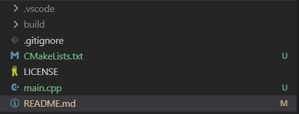

# ComputerGraphics_Studies


## [Initial Setup](https://github.com/hiperlogic/ComputerGraphics_Studies/blob/master/README.md)


## Initial Configuration: Application Framework and CMake Project Configuration
- Systems Covered (So Far): OpenGL, ~~OpenGL-ES~~, ~~Vulkan~~


Once all the tools are installed, create or open the folder to store the files for the processes. Use it in Visual Studio, preferably set is as your workspace.
From this point it is considered that you have installed the extension C/C++ for VSCode, CMake and CMake Tools, if you still haven't, go on and install them. I can wait, after all, from this point on, I'm just text!


### The CMake structure creation


There are several ways to configure a CMake project, but in this process we will configure as needed, so open the command palette and type in `cmake quickstart`, select the only option that should appear and you will have your first set up.


If the CMake environment within Visual Studio is configured, you will be asked to select a Kit for compiling.
If you are in windows, a Visual Studio (Community) installation is needed, unless you are using WSI (Windows 10) and it will ask you if you allow VSCode to use Intellisense for code completion, I would allow it, it is a great tool.


Now enter the name of the project and once this is done, the configuration is ready and you will have some new files and folders in your structure as displayed in the following image:




The folder “`.vscode`” is mandatory and relates to your project only. It is advisable to add it to the file “`.gitignore`”.

The folder “`build`” can also be added to “`.gitignore`”, since it contains a set of files generated by makefile to effectively build your project. 
The quickstart creates a basic `main.cpp` file and executes to create all these structures. 
This process is done to check for errors in the configuration, like a wrong kit selected, or errors in the compiler. All these can be ignored or deleted, but I advise to let them there.

The `CMakeLists.txt` is the file we are interested in this moment. Its main content should be something like:


```
cmake_minimum_required(VERSION 3.0.0)
project(CG_Studies VERSION 0.1.0)


include(CTest)
enable_testing()


add_executable(CG_Studies main.cpp)


set(CPACK_PROJECT_NAME ${PROJECT_NAME})
set(CPACK_PROJECT_VERSION ${PROJECT_VERSION})
include(CPack)
```


The first line demands that the CMake used to generate the build files is equal to or greater than version 3.0.0, while the second line states the version of this project.


Then there are the two lines that set the testing tools for the project, this won't be covered.


The command add_executable contains the name of the project you provided and the `main.cpp` file created by the quickstart command.


The project name will be the name of the executable and the files listed in sequence are the ones used in creating the executable.


Finally, the last lines specify the instructions to generate a package with the result.


With this structure you can hit build and check the results. If your configuration was done properly, the executable should be placed in the `build` folder with the name as specified in the `add_executable` instruction and can be called via shell or command line.


But, this project intends to present Computer Graphics processes, the individual capabilities, features or functionalities provided by OpenGL and Vulkan that, when composed, produces those marvelous results we can watch.


So, the initial step is how to create a window to display what we want... and then process to displaying what we want, individually, each in one different executable.


For this the projects will use the following development and runtime libraries:


- GLEW (libglew): The OpenGL Extension Wrangler library.
- GLM (libglm): A Mathematical set of instructiosn to be used in the application.
- GLFW (libglfw3): A simple framework to help the creation of multiplatform visual applications with easy configurations for OpenGL and Vulkan.
- [STB](https://github.com/nothings/stb): In fact, stb_image.h, instructions to load images.
- Vulkan(https://vulkan.lunarg.com/sdk/home): The Vulkan development library (drivers are necessary).


If you are on linux (ubuntu), all, maybe except `STB`, are available via the distribution package manager. On windows all are available within `vcpack`.


Next steps: Create the folder for the first project, set up the build instructions and code the source.

