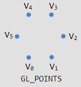
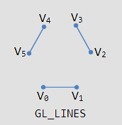
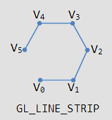
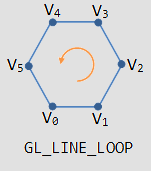
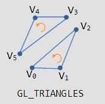
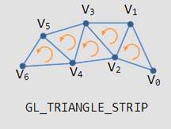
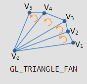
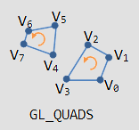
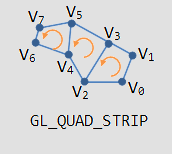
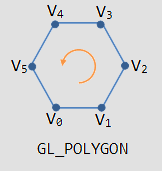

# ComputerGraphics_Studies
- Systems Covered (So Far): OpenGL, ~~Vulkan~~
________________________________________________________________________________
## [00 - Initial Setup](https://github.com/hiperlogic/ComputerGraphics_Studies/blob/master/README.md)

________________________________________________________________________________
## [00 - A - Initial Configuration: Application Framework and CMake Project Configuration](https://github.com/hiperlogic/ComputerGraphics_Studies/blob/00_CMake_Project_Create/README.md)

________________________________________________________________________________
## [00 - B - CMake Specific Configuration, Project Folder Structure and Code](https://github.com/hiperlogic/ComputerGraphics_Studies/blob/00_a_Project_Structure_And_Setup/README.md)

________________________________________________________________________________
## [00 - C - Finishing the Project Configuration](https://github.com/hiperlogic/ComputerGraphics_Studies/blob/00_b_app_framework/README.md)

________________________________________________________________________________
## [00 - D - App Framework Extras](https://github.com/hiperlogic/ComputerGraphics_Studies/blob/00_c_app_framework_extras/README.md)

## [01 - Creating the First Graphics and A New Project](https://github.com/hiperlogic/ComputerGraphics_Studies/blob/01_OpenGL_The_First_Graphics/README.md)

## 01 - A - Sending Data to OpenGL

Back in the day when OpenGL major version was no bigger than 2, the technology provided a hardware architecture specification called `fixed pipeline` or `fixed function pipeline`, which set available two basic modes of drawing named `immediate` and `retained` mode.
Since retained mode is the default in the programmable pipeline, only the immediate mode will be focused in this section.

### The Fixed Function Pipeline

The fixed function pipeline was the main OpenGL pipeline process as designed when OpenGL was idealized, in a time where only the immediate mode was available and this was the first steps to learn OpenGL, so let's present it.
In order to use the Fixed function pipeline two procedures must be taken, configure the matrices to process the vertices and configure the OpenGL state machine to receive the vertices. Those procedures are coded in the mainLoop routine, the configuration is coded prior to the loop, while the data delivery/retrieval is configured within the loop.
It is called fixed function pipeline because once you set up the OpenGL state machine for projection, viewing (camera) and model (object setup in the scene), prior to sending the vertices to the primitive processing queue, there was no way of modifying the data sent.
In immediate mode the vertices are sent directly, one by one via application loop, to the `Primitive Processing`. In retained mode, with the configured and stored vertex buffers via application, they are sent by request to the `Primitive Processing`. 
Then those vertices were transformed by the matrices configured and if any lighting configured as well, their light attribute were computed. This is the `Transform and Lighting` stage.
Once transformed and "lit" (in fact their "illumination" factor is set, this is used in the rendering process as parameter to compute actual pixels) the vertices are sent to the `Primitive Assembly`.
It is on the `Primitive Assembly` that the vertices are enqueued and processed according to the geometrical configuration. This will be detailed ahead. 
This ends the vertex stage for the fixed function pipeline.
Then it go to the `Rasterizer` to decide which part of the screen (which pixel) will be lit and indicate which vertices influence that pixel.
The result of the rasterizer and color (ilumination) data for the lit pixels goes through the next stage, to compute the actual value for the pixel.
First of all, if there is a texture assigned to the pixel, uses the information for texture coordinate (this will be addressed in its own project) to retrieve from the `Texture Environment` and calculate the pixel color related to the texture and send it to the `Color Sum` process to compute the pixel color without the texture, that is, using only the attributes set via lighting parameters to compute the contribution and value of the untextured lit pixel and perform the composition operation of that color with the textured pixel color.
There is the possibility for the user to configure `Fog` in the fixed function pipeline. This is usually done to mimicry the result of distance fading, so if configured, this is where the computations occurr, using the depth value of the fragment pixel to compute its new color.
If an `Alpha Test` is configured, it is processed in the sequence, using the alpha value of the color to compose the new pixel color.
From the `Texture Environment` until the `Alpha Test` process we have a simplistic equivalent of the `Fragment Shader`.
The final stages of the fixed function pipeline is the `Depth and Stencil` processing, to decide if the pixel will go to the end result, the `Color Buffer Blend`, properly applying the results of the Alpha Test and the `Dither`, to produce an end result, in color, as close as possible to the computed, due to color belonging to an analog spectrum and the monitor belonging to a discreet spectrum.
The final result is sent to the Frame Buffer to be shown in the screen once the buffers are swapped (considering the use of a double buffer).

#### OpenGL Matrices Configuration

The matrices instructs OpenGL how to process the vertices prior to proceed to the rasterization (fragment) processing and two matrices need to be configured, the projection matrix and the model-view matrix, in this order.
It starts with the (now) deprecated instruction `glMatrixMode`, with the parameter `GL_PROJECTION`, a constant that sets the state of OpenGL related to its manipulation matrix to manipulate the projection matrix.
The projection matrix represents the last transformations done to the vertices before knowing where to draw them on the screen.
The second instruction assigns to the current OpenGL matrix (that would be the projection matrix) the identity value in order to reset the data and properly configure it as is done in the third instruction, `glOrtho`, that will configure the view volume.
View Volume is the name of the volume that represents the objects or vertices that will appear on screen. In this case, it is set for the homogeneous coordinates, meaning an interval between -1.0 and 1.0 in all axis (X, Y, Z).
Since the configuration set it using glOrtho, the view volume is a cube. The following code represents the routine to configure OpenGL.
The next two instructions tell OpenGL that we are no longer configuring or manipulating the projection matrix, but the ModelView matrix.
The modelview matrix deals with the information related to the camera (view) and to positioning the vertices in the world (model) and will be more detailed when discussing 3D graphics.
Oh, the last instruction you should be familiar already!

```
    // Tell OpenGL state machine which matrix we will configure
    glMatrixMode(GL_PROJECTION);
    // Set the matrix to the identity
    glLoadIdentity();
    // Configure the matrix acording to the orthographic view
    // Homogeneous coordinates: Horizontal, Vertical and Depth (X,Y,Z) from -1.0 to 1.0
    glOrtho(-1.0,1.0,-1.0,1.0,-1.0,1.0); 
    // Tell OpenGL we are no longer modifying the projection matrix, but the modelview matrix.
    glMatrixMode(GL_MODELVIEW);
    glLoadIdentity();
    // Configure the clear color as we already have learned
    glClearColor(0.0, 0.0, 0.0, 0.0);
```
Before we continue to the display section, it is important to note that in the `initSystem` routine the instructions to setup the glfw window context configuration, those with `hint` in their name, were commented.
This is because they were setting OpenGL to a version that no longer implements the fixed function pipeline and our code would not work. The windows would be openned, the clear color set would erase the window screen to the color, but no graphics would be rendered.

#### Display

In order to display graphics on the screen, OpenGL must process some information.
Graphics on OpenGL are set in two ways: setting the pixel individually, as any other simple graphics API do, or passing coordinates and information and letting OpenGL handle the intermediary calculations to identify which pixels to light and with which color to light them. The first way will not be covered here.
The information passed to OpenGL are vertices and a `"value"` indicating how that vertices should be processed. Such value is represented by a constant already defined in OpenGL, which is also used in the programmable pipeline, the drawing mode that will be focused on.
In order to draw using the imediate mode we need to specify to the OpenGL that we are in the process of sending data to a `vertices queue`, `color queue` or `texture coordinate queue` (for lack of a better definition, let's call it this way), by issuing the instruction `glBegin`. For the moment only vertices are being considered. The queue is cleared and the process of sending data is performed by instructing OpenGL to end this state of vertices retrieval issuing the instruction `glEnd`.
Think of this pair as the identifier that indicates the begining of a block of code and the end of a block of code, respectively. And consider their function as those, indeed, meaning that you can have loops or branches that encloses them, loops or branches enclosed by them, but you cannot have loops or branches that encloses just one of them, or just one of them enclosed by the loops or branches.

> Important to consider, if a loop encloses the pair `glBegin-glEnd`, it will issue the command to start and end the queue at each loop. If, instead, the loop is enclosed by the pair, they are called only once. This can save a few cycles of processing.

The instruction `glBegin` not only initiates the OpenGL state machine to receive data (the queue), it also specifies how the vertices are to be processed to generate the graphics. The parameter informed in its arguments, that `value` mentioned the third paragraph of this section, are one of the following: GL_POINTS, GL_LINES, GL_LINE_STRIP, GL_LINE_LOOP, GL_TRIANGLES, GL_TRIANGLE_STRIP, GL_TRIANGLE_FAN, GL_QUADS, GL_QUAD_STRIP and GL_POLYGON. They set the OpenGL state machine to work the following way:

* GL_POINTS: Each vertex passed is processed and a point is generated and the vertex is removed from the queue 

;

* GL_LINES: On each second vertex a line is generated (rendered), both are removed from the queue 

;

* GL_LINE_STRIP: On the second vertex a line is generated (rendered), the first vertex is removed from the queue, the second remains to be used as the first vertex for the next operation, if any 

;

* GL_LINE_LOOP: On the second vertex a line is rendered, the first vertex is removed from the queue, the second remains to be used as the first vertex for the next operation. The very first vertex is stored, when no more vertices remain, the last vertex informed is used as the first vertex and the stored vertex is used as the second, closing a loop 

;

* GL_TRIANGLES: On the third vertex a triangle is rendered and all vertices are removed from the queue 

;

* GL_TRIANGLE_STRIP: On the third vertex a triangle is rendered, the first vertex informed is removed from the queue, the two remaining are used in the next operation, if any 

;

* GL_TRIANGLE_FAN: On the third vertex a triangle is rendered. The first and third vertices remain in the queue, the second is removed from the queue. The third assumes the position of the second for the next operation, if any 

;

* GL_QUADS: On the fourth vertex a quad is rendered. All four vertices are removed from the queue 

;

* GL_QUAD_STRIP: On the fourth vertex a quad is rendered, the first two vertices are removed from the queue and the remaining are shifted for the first and second position. This operation has its peculiarities due to this practice. Check out the image and try to figure out what it is 

;

* GL_POLYGON: It is somewhat similar to GL_LINE_LOOP, but can be filled. However, it has a limitation that the polygon formed must not have concavity 

.


> Tip: This will be really valid when discussing 3D graphics and data, but for sake of simplicity, let the vertices in triangles ordered counterclockwise. This is due to a concept of spatial orientation better known as "the right hand rule" for computer graphics. Go ahead and check it out if you wish, it will be slightly covered in the future. (Slightly because this whole document is to help me remind OpenGL and learn Vulkan, not Computer Graphics theory, which is math and I'm pretty much familiar!)

In order to draw a single isosceles triangle, considering the space spanning from -1.0 to +1.0 in all three axis and an orthographic projection (this guarantees a 2D space rendering), we need to clear the buffer, optionally set the current draw color, start the data (vertices for now) sending process, send the vertices (or other data) and end the data sending process. If a double buffer is to be used, the buffer switch is mandatory.

Prior to instruct how to send the vertices (or other data), it is important to get used to the OpenGL taxonomy system. This will make life much more easy.
OpenGL taxonomy splits the naming structure into 4 main sections: the library, the operation, the data quantity and the data type.

* The library: The library can assume a series of value, but basically you will encounter the prefix `gl`, for main OpenGL library, and `glu` for the OpenGL Utils library. The other routines in the examples will use the `glfw` prefix, indicating instructions from that library. So, if errors occurr, identifying the culprit can be made easily;
* The operation: gl`ClearColor`, gl`Clear`, gl`Begin`, gl`Vertex`3f. Section that indicates the proper instruction issued to OpenGL. There are no ways of knowing what they do except by reading the manual or the technical documentation. A word of advice: there are tools that aggregates documentations and even integrates with coding editor. Try [Zeal](https://zealdocs.org/), for instance;
* The data quantity: This section specifies how many data needs to be informed in the parameter or how many data are retrieved from a memory address each time. The instruction glVertex`3`f indicates 3 arguments to be informed to the instruction;
* The data type: This section informs the data type to be informed to the arguments. The arguments can be provided individually or at once, using a contiguous area in memory, usually know as an array. They can be of floating type (`f`), double (`d`), integer (`i`) or short (`s`). If an array is specified, the datatype must add a `v` in the end.

With this information in mind, the following code is expected to be understood:

 ```
    // Clear the screen. It's not mentioned before Tutorial 02, but it can cause flickering, so it's there nonetheless.
    glClear( GL_COLOR_BUFFER_BIT );

    // Draw a white triangle
    glBegin(GL_TRIANGLES);
        glVertex3f(-1.0,-1.0,0.0);
        glVertex3f(1.0,-1.0,0.0);
        float top[3] = {0.0,1.0,0.0};
        glVertex3fv(top);
    glEnd();

    glFlush();
    // Swap buffers
    glfwSwapBuffers(window);
```

The previous code is the proper code to draw a triangle using the immediate mode and the fixed pipeline at OpenGL. In it the instructions to clear the screen, set the OpenGL state to receive and to end the retrieval of data, and the data deliver instructions considering individual parameters and pointer (array, or contiguous memory, data) are demonstrated.
It will be revisited in the next section to illustrate the colored triangle and multi colored triangles.

## Assigning a logical device to a physical device in Vulkan

So the first logical steps were taken, the Vulkan driver instance was created and its features verified (and the debug feature was set), from the instance the physical devices were probed and the one with graphical capabilities was set. To know that the physical device have graphics capabilities its queues were probed. Only one queue with graphics capabilities is enough for the device to work for rendering in Vulkan.
Now the step is to bind the physical device to a logical device, so it can be controlled. The process to create a logical device is similar to setting up the application info, the Vulkan instance or the debug info, that means, populate the structure with the wanted or needed features and call the function to instance the logical device.
The logical device, represented via structure `VkDevice` needs to be referenced within the application, so, let's add it as a private attribute to the WindowAppWrapper class, naming it `device`. Also, let's add one more private method to the class, naming it `createLogicalDevice` and calling it within `initVulkan`, right after `setPhysicalDevice`.

The structure to create the logical device, `VkDeviceCreateInfo`, requires the queues and the desired device features to be used, and they also are represented by structures, `VkDeviceQueueCreateInfo` and `VkPyshicalDeviceFeatures`.

### Specifying the queues to be created

Each queue family is specified via structure `VkDeviceQueueCreateInfo`, which reports the family index and indicates how many queues of that family the application requires.
An application can specify some queues of a specific family to be used, this number is small, but rare are the cases where more than one is used, because the command can be buffered via multiple threads and then submitted al at once on the main thread. Apparently this is done with a single low-overhead call.
Also, there is the possibility (and the need) to assign a priority to the queue, a floating point value ranging from 0.0 to 1.0. Required even if a single queue is used.
So, the createLogicalDevice method, so far, would have:

```C++
// There is the need to get the index of the family queue that supports graphics operation within the device
QueueFamilyIndices indices = findQueueFamilies(physicalDevice);

// This holds the structured data to require the queue
VkDeviceQueueCreateInfo queueCreateInfo = {};
queueCreateInfo.sType = VK_STRUCTURE_TYPE_DEVICE_QUEUE_CREATE_INFO; // The structure type
queueCreateInfo.queueFamilyIndex = indices.graphicsFamily.value(); // The queue family with graphics capability
queueCreateInfo.queueCount = 1; // How many queues to create

float queuePriority = 1.0f;
queueCreateInfo.pQueuePriorities = &queuePriority;
```

### Specifying what device features to use

In the previous section, when retrieving the device and checking if it was suitable, previous to probing the queue family, the device features was consulted. It was when the geometry shader feature was verified.
Vertex, Fragment and Geometry shaders are types of features that will be required in the future, when drawing complex structures. But for the moment, no feature are needed. This will be revisited when demanded.
However, the logical device structure demands the specification of device features, even if none, so:

```C++
VkPhysicalDeviceFeatures deviceFeatures = {};
```

### Creating the logical device

As both structures are ready, they can be used to fill their proper slots in the VkDeviceCreateInfoStructure.
Structures in Vulkan follow a pattern. All of them have the sType field, and that need to be filled. If they are related to other structures, those are informed as references.
In the case of queues, since there can be more than one queue requested, they need to be in contiguous area in the memory. The number of the queues need to be specified, as well as the number of extensions (features) requested.
Once all is specified, the logical device instance can be created, the queue handles can be retrieved and the presentation configuration can be performed.

```C++
VkDeviceCreateInfo createInfo = {};
createInfo.sType = VK_STRUCTURE_TYPE_DEVICE_CREATE_INFO;

createInfo.pQueueCreateInfos = &queueCreateInfo;
createInfo.queueCreateInfoCount = 1;

createInfo.pEnabledFeatures = &deviceFeatures;
```

The remainder information is quite similar to the procedure used to set the validation layers and extensions when creating the Vulkan instance. The only difference is that this time they are specific to the device:

```C++
createInfo.enabledExtensionCount = 0;

if (enabledValidationLayers) {
    createInfo.enabledLayerCount = static_cast<uint32_t>(validationLayers.size());
    createInfo.enabledLayerNames = validationLayers.data();
} else {
    createInfo.enabledLayerCount = 0;
}
```

And for the moment, the information is set. This will be revisited when needed. Now it is time to create the logical device using the function `vkCreateDevice` which receives the physical device related, the create info structure to configure it, the allocator (null pointer for now), and the address to store the logical device handler. If not successful, throw an exception.

```C++
if(vkCreateDevice(physicalDevice, &createInfo, nullptr, &device) != VK_SUCCESS) {
    throw std::runtime_error("failed to create the logical device!");
}
```

And the logical device is created. Now it is time to retrieve the required queue.

### Retrieving the Queue handles to send commands to Vulkan

Finally it is time to retrieve the queue from the logical device, this will create a bind from the application to the configured hardware.
For that it is needed to create the queue handler identifier, so, one more private attribute to the class, with type `VkQueue` and call the `vkGetDeviceQueue` to retrieve it.
Each queue family can address a number of queues for a device, but only one is being specified in this process, so we only have one index for it and it will be set to zero. Declare the private attribute, name it `graphicsQueue` and call the function in the end of the `createLogicalDevice`:

```C++
vkGetDeviceQueue(device, indices.graphicsFamily.value(), 0, &graphicsQueue);
```

And it will store in graphicsQueue, the private attribute for the class, the handler for the queue considered as index 0 of the graphicsFamily queue available in the device.

Compile the project and check if no errors are raised.
...
One is... (if you have re-enabled the destroy debug message in cleanup, otherewise you will see more!)
The one error within this context is that the device was not destroyed! It needs to be, so, just add the instruction:

```C++
vkDestroyDevice(device, nullptr);
```

To the `cleanup` method, compile and test again to check the error is gone!


Next: 
    OpenGL The Programmable Pipeline
