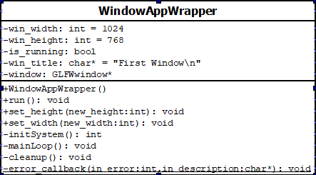

# ComputerGraphics_Studies
- Systems Covered (So Far): OpenGL, ~~Vulkan~~
________________________________________________________________________________
## [Initial Setup](https://github.com/hiperlogic/ComputerGraphics_Studies/blob/master/README.md)

________________________________________________________________________________
## [Initial Configuration: Application Framework and CMake Project Configuration](https://github.com/hiperlogic/ComputerGraphics_Studies/blob/00_CMake_Project_Create/README.md)

________________________________________________________________________________
## [CMake Specific Configuration, Project Folder Structure and Code](https://github.com/hiperlogic/ComputerGraphics_Studies/blob/00_a_Project_Structure_And_Setup/README.md)

________________________________________________________________________________
## Finishing the Project Configuration

Cmake and VSCode now are set up and compiling the source within the specific folder for the project, we are ready to end up the first set of code and move on to the next ones.

Since the project uses external libraries, such as glew, glm and glfw, it is important to configure CMake to use those libraries, appending them to the project and configure the build files so they can be linked (statically or dinamycally) in the final executable.

Assuming the resources are already installed in the system, the `CMakeLists.txt` need to be updated by including the following instructions at the end of the file:

```
find_package(OpenGL REQUIRED)
find_package(GLEW REQUIRED)
find_package(glfw3 CONFIG REQUIRED)
find_package(glm REQUIRED)

# Linux systems demands the explicit inclusion of libGL.
if(UNIX)
  target_link_libraries(00_OpenGL_app_framework PRIVATE GL)
endif(UNIX)
target_link_libraries(00_OpenGL_app_framework PRIVATE GLEW::GLEW)
target_link_libraries(00_OpenGL_app_framework PRIVATE glfw)
target_link_libraries(00_OpenGL_app_framework PRIVATE glm)
```

The `find_package` instruction tells CMake to search for the installed package and set all the variables related to them in order to properly compile the project.
Two flags are specified in the instruction: REQUIRED and CONFIG.
Required tells the system to halt the process of creating the building files in case the package was not found. CONFIG tells the process to attempt to locate a configuration file provided by the package to be found.

The last three instructions are responsible to provide the data needed to link the libraries to the project. The first parameter is the project name, this will be important when we add another project to the set.
If the library linked will be provided for other resources other than the project, say, our project is a library that uses it, then the second parameter would have to be PUBLIC. Since we are providing executables, it needs to be PRIVATE.
The third parameter specifies the library to be linked. It also specifies where the build system is supposed to find the “include” files for that set of instructions.

If you groked everything mentioned about CMake and how its configuration is used to create the build files to compile the project, congratulations, you can manage about 80% of project creation with CMake.

Now, to the specifics, the application.

________________________________________________________________________________
## Coding the Application Framework

In order to simplify the process of creating the windows, considering the purpose of the code compiling and running in Windows and Linux systems without (too many) tweaks, the framework GLFW will be used.
This one can be replaced by other frameworks, such as SDL or SFML, for instance, in case you know them better.

The base code implemented in these projects are derived from the Base Code in the [Vulkan Tutorial site](https://vulkan-tutorial.com/Drawing_a_triangle/Setup/Base_code).

The first application will put the app window framework class and the main instructions in the same file for simplicity, but we will improve this along the experimentations.

All code will be generated with an attempt to follow (or pursue) the best principles of software design patterns, even when things seem messy, they will be improved to fit into any good cathegory, so we can recapture all those lessos taught in software engineering.

________________________________________________________________________________
### Principal Class
The following image presents the idea of the first class to be coded, and the main one in the projects:



________________________________________________________________________________
### WindowAppWrapper Class

Considering the class representation, WindowAppWrapper will be the name of the class to be created in the application.
Applications can have multiple windows, so, in the name of experimentation, this class will not be a `singleton`.

________________________________________________________________________________
#### Private Attributes
It has five private attributes:
* win_width: specifies the width of the window to be created;
* win_height: specifies the height of the window to be created;
* win_title: is the title `string` to appear on top of the window;
* is_running: indicates if the system is running;
* *window: The pointer to the graphical window.

________________________________________________________________________________
#### Private Methods
Along with that, four private methods:
* initSystem: returns false if the system failed to initialize;
* mainLoop: will run until the window is closed, a key to close is pressed or the process is killed;
* cleanup: perform the resources cleanup upon closing the application.
* error_callback: a static method to provide GLFW error information.

________________________________________________________________________________
#### Public Methods
There are no public attributes, but there are four public methods:
* WindowAppWrapper: is the constructor. There are no parameters to be passed in this moment (this will be improved in the future);
* run: this is the method to be called to start the application;
* set_width: adjusts the width of the window to be created. If the window has been created, this method does nothing;
* set_height: asjusts the height of the window to be created. If the window has been created, this method does nogthing.

================================================================================
### Implementations
Let's look at the methods to be implemented. Let's look at them in their order of execution.

________________________________________________________________________________
#### The Public Methods

________________________________________________________________________________
##### The Constructor
A special method within Object Oriented programming, the constructor only initiates the attribute `is_running` with false. So, `this->is_running;` is the only instruction found in it so far.

________________________________________________________________________________
##### Dimension methods: set_height and set_width
Once the object is instantiated, the coder can call set_width or set_height to adjust the desired window dimensions.
Those methods only set the object respective attributes if the `is_running` attribute is `false`, so both codes are somewhat the same:
```
void set_width(int new_width){
  if(!this->is_running) this->win_width=new_width;
}
```
and
```
void set_height(int new_height){
  if(!this->is_running) this->win_height=new_height;
}
```

________________________________________________________________________________
##### The run method
Finally, the only method the code can call: `run`.
`Run` performs basically three things: Initializes the system, calls the main loop and then call the cleanup to finish the application.
But since the system initialization can fail, returnin a false value, we can use this information to control if the main loop will be effectively called, rendering our code as: 
```
void run(){
    this->is_running = 1;
    int result = initSystem();
    if( result != EXIT_FAILURE )
        mainLoop();
    cleanup();
    this->is_running = 0;
}
``` 
Observe that the very first instruction in the run method it indicates that the system is running, reseting it in the last instruction.

================================================================================
#### The Private Methods
Now, for our three remaining private methods, in the respective order: error_callback, system initialization, main loop and cleanup.
________________________________________________________________________________
##### error_callback
Sometimes errors occur and the code logic have nothing to do with it. Sometimes it is due to hardware failure or resources constraints. When this happens, the system crashes and if nothing is presented, we are left wondering: What happened? What did I do wrong? Was it I?
There may be several places where things can go wrong, mainly with a complex system as the graphical management system, as Windows or X, and try to put error verification in every possible place is a huge task. That's why GLFW implemented a method to capture errors related to its instructions (the Window Graphical System) and provide information as it happens, with just a few lines of code.
First we need to write the instruction to return the error. Since this is a common instruction, not related to an object, but to a class, this will be a static method.
It returns no data, the error already occurred. It just prints what happened, but it needs two information: an integer representing the error code and a string, containing the error message, as depicted below:
```
static void error_callback(int error, const char* description){
    fprintf(stderr, "Error: %s\n", description);
}
```
________________________________________________________________________________
##### initSystem
Graphics application deals with some resources that determine how they will be displayed, where they will be displayed, what resources do they use, what is the data format stored (or to store) in the computer memory, or in the GPU memory, how to use the GPU (I'm talking about you Vulkan!). All of these needs to be configured so the operating system can allocate the resources, inform where they are and how to use them and properly display the windows.
In this section we are dealing only with OpenGL, so let's stick to that and improve later to a more generic solution.
And let's use the GLFW framework to make this kind of configuration easier, and able to execute in several platforms without much trouble.
The main steps taken in the initialization system are:
1. (*) Initialize the framework;
2. (*) Configure the window and the canvas attributes
3. (*) Create the Window with: ```this->window = glfwCreateWindow(this->win_width, this->win_height, this->win_title.c_str(), NULL, NULL);```
4. Assign the window to the graphics processing making it the current context with ```glfwMakeContextCurrent(this->window);```
5. (*) Initializes GLEW

There are three main points of validation in this process.
* If the framework fails to initialize (1.), then there are nothing to be done, something is terribly wrong, check the error messages and seek or ask for solutions. But if happens, the initialization must return an EXIT_FAILURE value.

In order to verify the error, we need to setup the callback routine to be called when an error occurs. The routine was already presented, remaining only its configuration:

```
glfwSetErrorCallback( WindowAppWrapper::error_callback );
```

And the glfw initialization:

```
if(!glfwInit()){
    std::cerr << "GLFW Failed to initialize" <<std::endl;
    return EXIT_FAILURE;
}
```

* In the window creation (3.), if the value returned is NULL, the creation failed. When there are no windows to display the results, the system is useless, so, it must return an EXIT_FAILURE.

```
if( this->window == NULL ){
    std::cerr << "GLFW Failed to initialize" << std::endl;
    glfwTerminate();
    return EXIT_FAILURE;
}
```

* GLEW is the tool to set available the OpenGL extensions, much of which are used nowadays. If it fails to initialize (5.), much of the code will fail, so the system must return an EXIT_FAILURE.

```
glewExperimental = true;

if (glewInit() != GLEW_OK) {
    std::cerr << "GLEW Failed to initialize" <<std::endl;
    glfwTerminate();
    return EXIT_FAILURE;
}
```

All of these are easily read from the code, the only one that demands more details is the configuration of the windows and canvas attributes. Let's look at them:

```
glfwWindowHint(GLFW_SAMPLES, 4);
glfwWindowHint(GLFW_CONTEXT_VERSION_MAJOR, 3);
glfwWindowHint(GLFW_CONTEXT_VERSION_MINOR, 3);
glfwWindowHint(GLFW_OPENGL_FORWARD_COMPAT, GL_TRUE);
glfwWindowHint(GLFW_OPENGL_PROFILE, GLFW_OPENGL_CORE_PROFILE);
```

They all are called using the same instruction: `glfwWindowHint`, only varying their parameters.
`GLFW_SAMPLES` relates to antialiasing processes and tells the system to be configured using MSAA `4`, a four passes antialiasing.
`GLFW_CONTEXT_VERSION_MAJOR`/`MINOR` tells the system that the required OpenGL must not be less than the version 3.3.
`GLFW_OPENGL_FORWARD_COMPAT` tells the system if this code must be compatible with newer OpenGL versions. True in this case.
`GLFW_OPENGL_PROFILE` Tells the system to uyse the OpenGL Core Profile specification for the version specified.

For more information on these hits, consult the [GLFW Window Guide](https://www.glfw.org/docs/latest/window_guide.html)

If all 5 steps went well, then there is the sixth step:
6. return EXIT_SUCCESS;

________________________________________________________________________________
##### mainLoop
In graphical applications the main loop is basically an endless loop that is broken via command.
So, there is need to configure the system to identify where those commands come and which commands are responsible to break the endless loop. This is the main issue in this process.
But let's go a step ahead. In each loop execution a graphics application process the data, drawing them in a buffer and them clear the current buffer to display the updated one, swapping both (if a double buffer is specified... with GLFW it always is for OpenGL).
So, the first instruction is to setup the input methods, done with the following instruction:
```
glfwSetInputMode(window, GLFW_STICKY_KEYS, GL_TRUE);
```

This instruction tells the GLFW process to check the keyboard state and allow it to be probed.

The loop is the second and last instruction. It is a do-while loop with the stop condition of the `ESC` key being pressed or the window being closed.
```
while( glfwGetKey(window, GLFW_KEY_ESCAPE ) != GLFW_PRESS &&
    glfwWindowShouldClose(window) == 0 );
```

The magic happens in between the do-while instructions.
Since we are switching buffers to draw, the very first thing to do is to clear the color buffer. The color buffer is where pixels are drawn and if not cleared, previously drawn pixels can be carried out to future frames if they are not overwritten.
So, just call the clear command from OpengL for the color buffer and all the worries are done:

```
glClear( GL_COLOR_BUFFER_BIT );
```

In the future more information will be provided for this instruction, just be happy that this clear the buffer so OpenGL can draw in a clean canvas.

Then there is the graphics code... the next section (Branch 01) will start this story. So far, be happy for an empty black window...

Once the draws were drawn, they need to be displayed. All graphics instruction, when double buffered (the standard), happens outside view and need to be swapped to be displayed. There is a reason why this is used and I encourage you to look for it, but here is not the place to explain it (Spoiler Alert: Visual Glitches!). Just issue the buffer swap command for the window and be happy you hadn't to code it yourself! (Although it is not that difficult to swap pointers, is it?)

```
glfwSwapBuffers(window);
``` 

finally, the last command within the main loop is responsible to poll events so the data from mouse, keyboard or such can be processed. Easy as doing a:

```
glfwPollEvents();
```

All we need to do is a

________________________________________________________________________________
##### cleanup
When the application closes, the resources it uses must be freed. The frameworks used need to be told to clean up their mess and let room for other applications to come.
Gladly GLFW does that quite easily, two lines of code and you are done!
```
glfwDestroyWindow(window);
glfwTerminate();
```

There, done, our class is ready and can be used...
Hope you've followed the instructions to guide you and coded yourself instead of proceeding to the practice of CTRL+C-CRTL+V, or worse, copied the whole main code!... At least read it and try to understand... it will be good for you in the future!
But you've reached here, so... Kudos! You can write your

================================================================================
#### Main Application

Without further ado:

* Declare the pointer variable to store the address of you window object;
* Instantiate the object (you can do both in just one line, you know?);
* Try and run the app (call the `run` public method within a try-catch structure);
* Catch the error, delete the app and return failure if an error occurred;
* Delete the app and exit with success if no error occurred.

And that's it!

```
int main() {
    WindowAppWrapper *app=new WindowAppWrapper();

    try {
        app->run();
    } catch (const std::exception& e){
        std::cerr <<e.what() <<std::endl;
        delete app;
        return EXIT_FAILURE;
    }
    delete app;
    return EXIT_SUCCESS;
}
```

Build your application and execute it to witness THE... frustration!
If you do not have a library in your path (like glew32.dll) it will fail.
In windows it complained about `glew32d.dll`. That is the same as `glew32.dll`, just copy it and rename it and be happy!
If the error persists, check the lib compilation. 
* Is it x86 or x64?
* Is the lib dir in the path?
* How about copy the lib binary (dll) to the same folder as is the project executable (build)?

Comming Next: I don't want to clean to Black! I Want to Clean to Fuchsia! How to do that?
